# Yape Code Challenge :rocket:

Our code challenge will let you marvel us with your Jedi coding skills :smile:.

Don't forget that the proper way to submit your work is to fork the repo and create a PR :wink: ... have fun !!

- [Problem](#problem)
- [Tech Stack](#tech_stack)
- [Send us your challenge](#send_us_your_challenge)

# Problem

Every time a financial transaction is created it must be validated by our anti-fraud microservice and then the same service sends a message back to update the transaction status.
For now, we have only three transaction statuses:

<ol>
  <li>pending</li>
  <li>approved</li>
  <li>rejected</li>  
</ol>

Every transaction with a value greater than 1000 should be rejected.

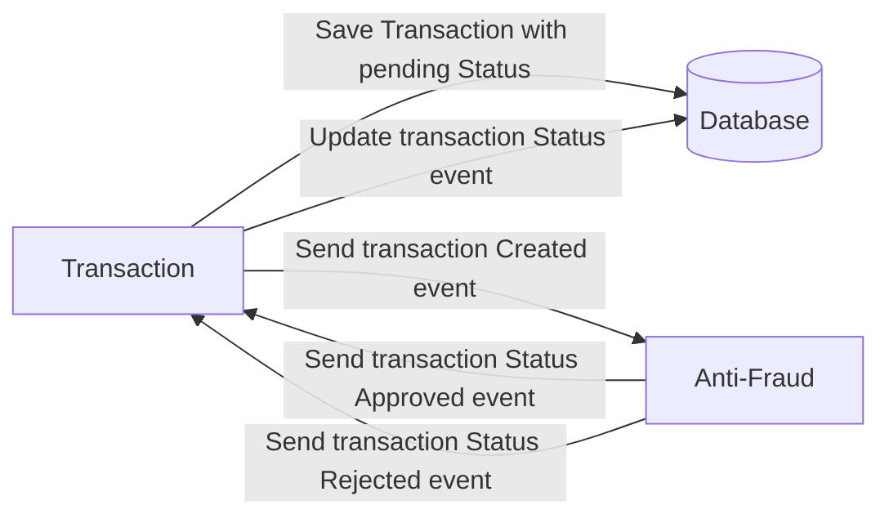

# Tech Stack

<ol>
  <li>Node. You can use any framework you want (i.e. Nestjs with an ORM like TypeOrm or Prisma) </li>
  <li>Any database</li>
  <li>Kafka</li>    
</ol>

We do provide a `Dockerfile` to help you get started with a dev environment.

You must have two resources:

1. Resource to create a transaction that must containt:

```json
{
  "accountExternalIdDebit": "Guid",
  "accountExternalIdCredit": "Guid",
  "tranferTypeId": 1,
  "value": 120
}
```

2. Resource to retrieve a transaction

```json
{
  "transactionExternalId": "Guid",
  "transactionType": {
    "name": ""
  },
  "transactionStatus": {
    "name": ""
  },
  "value": 120,
  "createdAt": "Date"
}
```

## Optional

You can use any approach to store transaction data but you should consider that we may deal with high volume scenarios where we have a huge amount of writes and reads for the same data at the same time. How would you tackle this requirement?

You can use Graphql;

# Send us your challenge

When you finish your challenge, after forking a repository, you **must** open a pull request to our repository. There are no limitations to the implementation, you can follow the programming paradigm, modularization, and style that you feel is the most appropriate solution.

If you have any questions, please let us know.

# Challenge

## Diagram

1. The flow begins when the client makes an HTTP request to an API that exposes some services, then makes a request to Transaction Microservice.
2. Transaction Microservice saves the data and sends a message to the Anti Fraud Microservice through Event Broker.
3. The Anti-Fraud Microservice validates the message and sends a new message with the status to the Transaction Microservice.
4. Transaction Microservice receives the message and updates the record with the new status.
5. When the Api makes a GET request, the first time the Transaction Microservice finds the record in the database it returns it from the DB but just at that moment a copy is stored
   cached with Redis, all requests to the same resource will be requested from Redis, so as not to saturate the DB

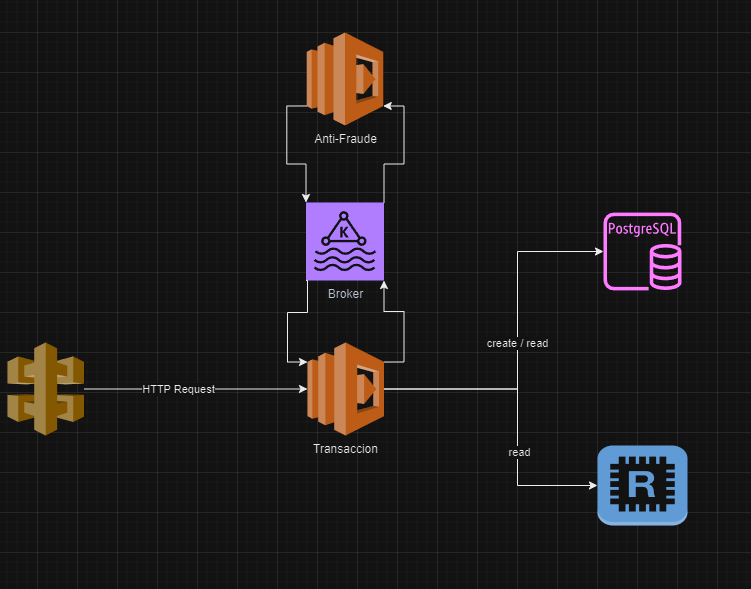

## API REQUEST

```
POST -> http://localhost:3000/transaction/
        body {
          "accountExternalIdCredit": "6021a743-d77c-498e-beda-d834e89106ec",
          "accountExternalIdDebit": "9fded260-d75a-4ef2-a735-bfa60fab7e30",
          "tranferTypeId": 1,
          "value": 1200
        }

GET -> http://localhost:3000/transaction/:id

```

## Setup project

1. set env variables
2. run scripts

```
> docker compose up -d --build
> Option 1
> npm run build
> cd transaction
> npm run generate
> npm run migrate
> npm run start:deev
> cd ..
> cd api
> npm run start:dev
> cd ..
> cd anti-fraud
> npm run dev
> Option 2
> ./start-all.ps1
```

## HAPPY PATH

## Result transaction.value = 900

1. started servers
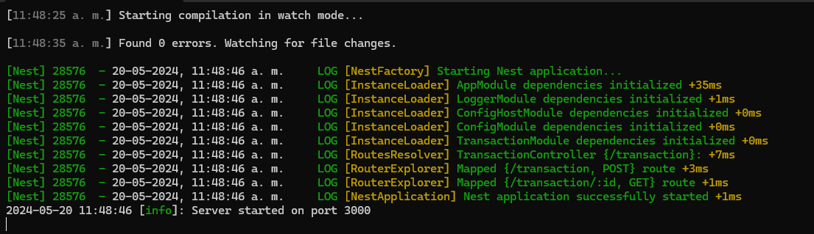
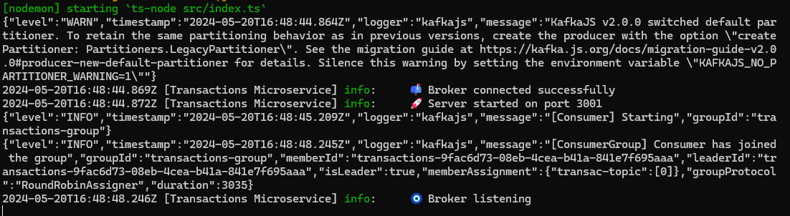
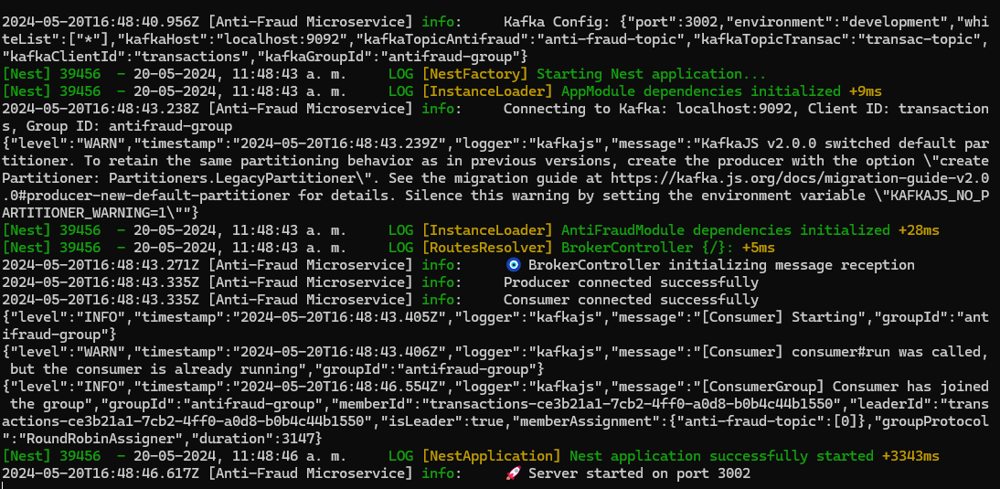

2. /transaction POST
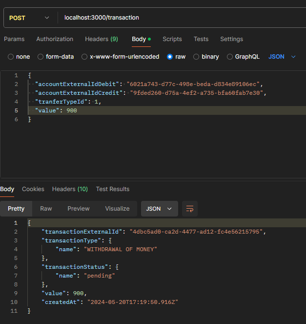
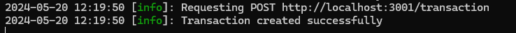
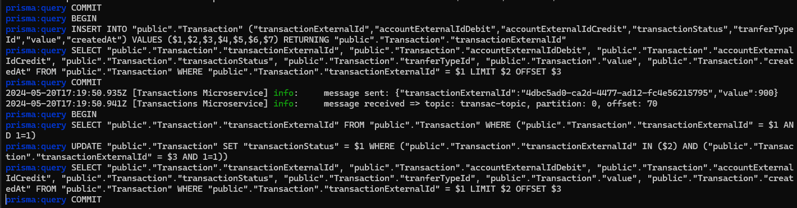
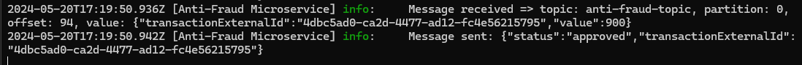
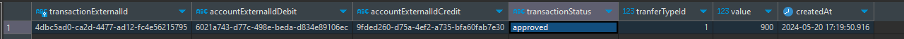

3. /transaction GET
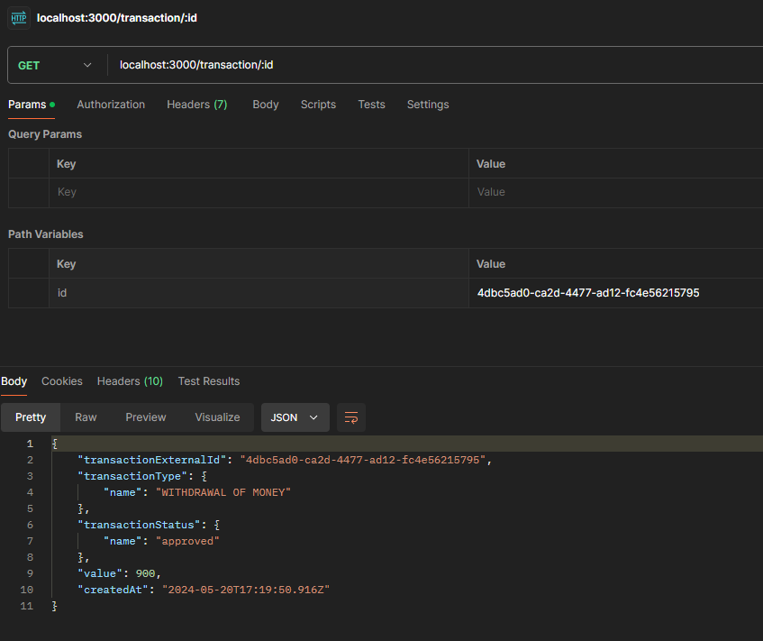
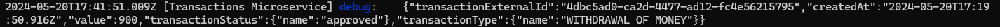

## Result transaction.value = 10001

1. /transaction POST
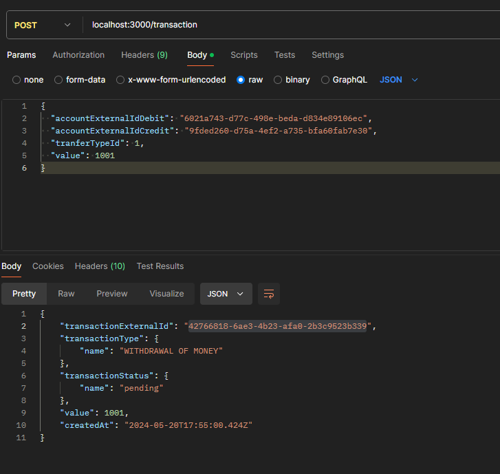

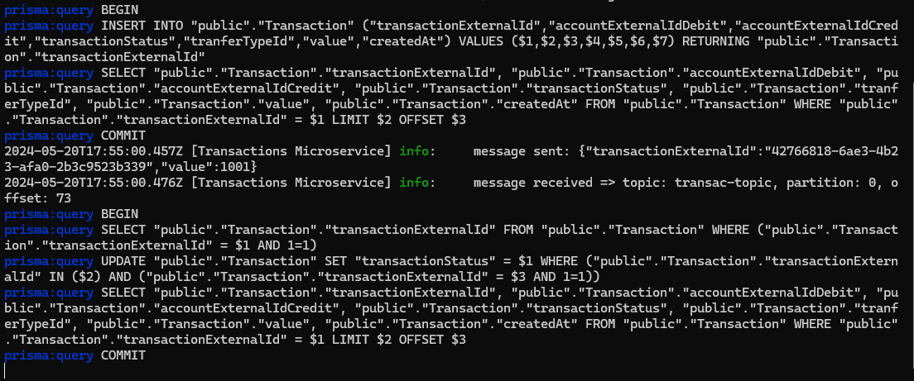
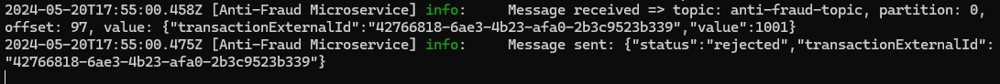
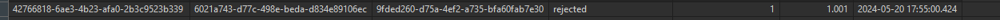

2. /transaction GET
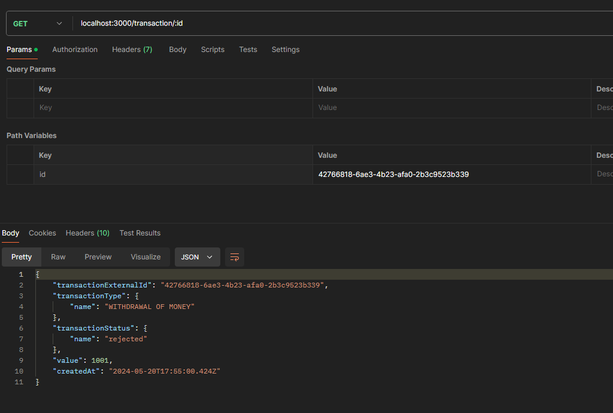
